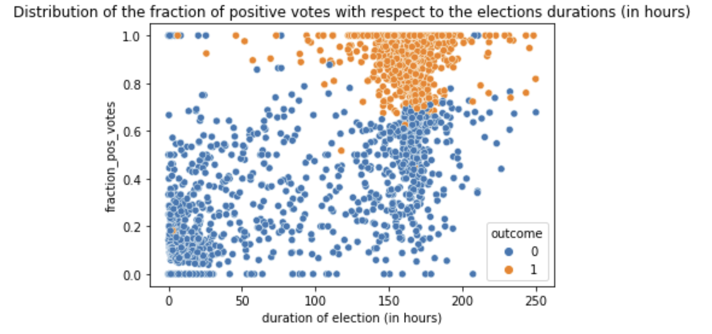
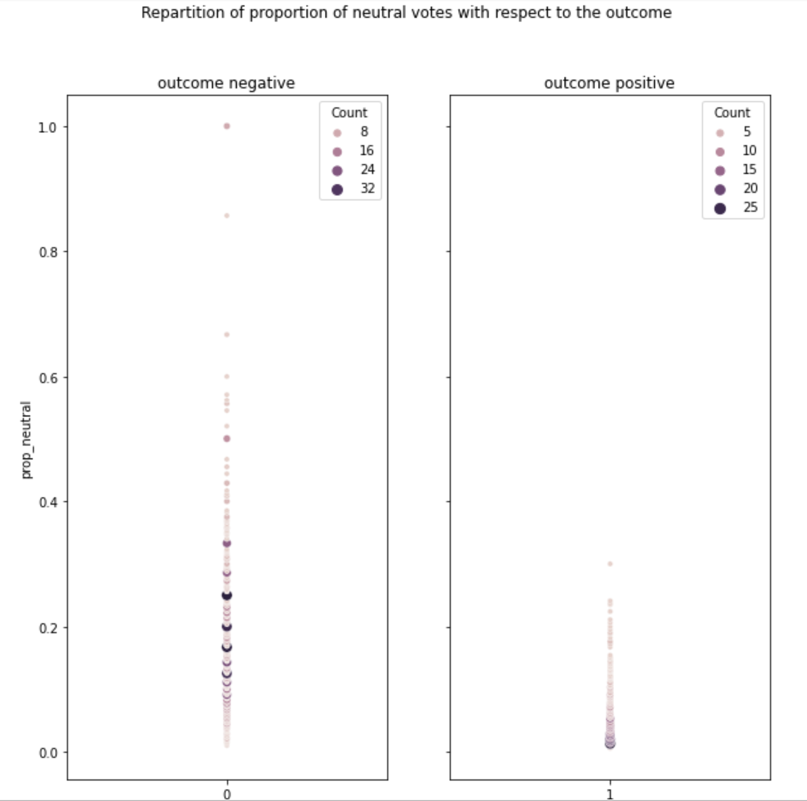

What can we learn from Wikipedia adminship elections ? 
How social network structure potentially influences voting in a time-dependent manner: analysis of a signed social network. 

Politics are everywhere. 
From seeking to be the class representative of your 5th grade class, to announcing you will be running for president (never say never, sometimes dreams DO come true), you are most likely to be involved in some kind of election throughout your life. 
We do not yet have the magic trick that will ensure you to get elected next time you run, but we are working hard on it. And for that, we chose to analyse past elections, exactly like football players review past games to improve their strategy. 
To this end, we chose to look back on Wikipedia Adminship elections that happened between 2004 and 2008. 
For some context : Wikipedia is the free online encyclopedia that we all know and love. Its articles are written by volunteers, amongst whom we can distinguish administrators. In addition of being able to write articles, those people also have access to technical features of the website, they are especially given the ability to help with its maintenance. But not anyone can become an admin that easily ! Adminship seekers have to go through a public election process which determines whether or not they are promoted. If you are more curious, a list of all admins can be found [here](https://en.wikipedia.org/wiki/Special:ListUsers?username=&group=sysop&wpsubmit=&wpFormIdentifier=mw-listusers-form&limit=50)

Before getting started, we also wanted to introduce the [Wikipedia bureaucrats](https://en.wikipedia.org/wiki/Category:Wikipedia_bureaucrats). Indeed, these bureaucrats are amongst others the ones deciding on when an election will be closed and on the outcome of the latter. Do they accord the same duration to every election and do they declare success of election if at least half of the casted votes is positive? Be patient, you'll discover! 

**We do not want to make you wait any longer, so tell us what you got Wikipedia!**

### TEMPORAL ANALYSIS 
## DATE
If you could choose the time of year your election will be held, would a certain move be more strategic than another? We definitely know that people are cheerier when, for example, Santa's coming to town, but is it to the point where it could influence a vote they would cast at this time of year? Or do people that cast their votes around this period of the year that you usually spend with your loved ones, far away from your screen, tend to somewhat adopt the mind set of the Grinch?  
Let's take a look. Its is important for further analysis to firstly observe how the number of elections evolved over time, when grouped by year.

*How did the number of elections vary over time ?*
To play around with the time length, click on the tiny lines in the legend!



Very interestingly, we can notice an **exponential-like increase** in the number of elections between 2004 (70 elections), 2005 (150 elections), 2006 (360 elections), and 2007 (2100 elections).
The numbers of elections are approximated here for better understanding.
Let's plot this with a log-scaled y-axis to investigate the exponential-like increase.
From the graph below, we can see a straight line for the years 2004, 2005, and 2006. However, the massive increase in the number of elections in 2007 was so large that it grew even faster than an exponential function.



O.K., let's now go back to the first plot. Click on the tiny blue line to display the analysis by day. 
The first thing that pops out are the peaks on May 3rd, 2007, during which more than 300 elections were closed, on May 26th with more than 200 elections being closed, and on December 4th with above 100 elections being closed. This raises some questions. What happened on these days ? Well, we found out that the famous Swiss illustrator Warja Lavator died on May 3rd, 2007. She was so talented, the bureaucrats could have closed the elections so that everyone could mourn in peace? Hmm... Seems unlikely. 
Rather, it could well be that Wikipedia bureaucrats decided to close a number of elections on a given day, which can be seen as 'house-keeping' day. In other words, Wikipedia bureaucrats might meet a few times a year to end elections for which the current votes are sufficient to properly decide whether a candidate should be given the adminship status or not.

Anyway, what about the number of votes? We could easily suppose that they tend to follow a similar trend than the number of elections, but let's actually verify it. 



Plot twist : the three peaks previously mentioned cannot be observed. This means that these three days were not particularly intense in terms of votes even though many elections were closed by bureaucrates on these days. It supports the hypothesis that Wikipedia bureaucrats 'cleaned up' the elections on these three days. 
It is clear that overall, the number of elections and votes have increased between 2004 and 2008. But what about the election outcomes? 



Well, it appears that the election outcome is highly variable over time. It fluctuates over months, weeks and days. And on top of that, it seems to vary in a non-periodic fashion! This can be seen through the very irregular patterns displayed on the plot.  
Overall, it suggests that closing an election at Christmas time, or at any other time for that matter, is far from being a guarantee that you will be elected... 

Now that you have a *perfect* understanding of the 'basic concepts' that we just investigated, if you want to dig deeper and keep looking into this time analysis, here is our Christmas present to you: A beautiful, colorful, complete visualization. You're welcome ;)

**Have fun and play with the plot! It supports the interpretations we made previously!**
Feel free to investigate the graphs by activating the traces for averaging over different time ranges and/or by zooming in! The number of elections or votes is visualized by the diameter of the bubbles.





We just could NOT resist making a few comments about these plots, so here they are :   
***About the votes (first plot):***
- Until around July 2005, the number of votes is quite low (smaller bubbles) compared to the number of votes from July 2005 until January 2008 (bigger bubbles). Interesting! It suggests (again) that over time more and more votes were casted for Wikipedia elections. 
- Focusing on the week range, we are sure you did not miss out on the *little red bubble* that does not follow the overall trend in January 2007, corresponding to the number of votes recorded the week ending with December 31st 2006. At first, it is no surprise, as one could expect that during the holiday season people tend to be away from the computer, spending time with their relatives. Sadly, looking at the overall trend, we cannot decipher a decrease in the number of votes at the end of each year. Additionally, the average vote of this bubble is quite low compared to the one of the bubbles surrounding it, apparently the people that voted during the 2006 holiday season were not very cheerful during that period of the year, does that remind you of [anyone](https://en.wikipedia.org/wiki/How_the_Grinch_Stole_Christmas_(2000_film))?

***About the elections* (second plot):***
What about the *large green bubble* ? It accounts for the near-thousand elections was were closed in the month of May 2007 -- encompassing two of our election-closure pics!

## DURATION 
O.K., so now you have chosen the perfect date for your election to be held (or not, as there might not be a perfect date). But it is not the only parameter to take into account if you want to maximize your chances of being elected. Another important point is the duration of the election. As Wikipedia elections are public and a discussion between voters can happen over all of the election duration, we can try and identify the optimal election duration during which you should campaign and hope that after the latter is over your election gets closed.
We analyse a large variety of durations to get a good grasp on the influence of this parameter. 

Let's also check if the different distributions of election durations are different between succeeded and failed elections.

More than 75% of the elections lasted less than 180 hours, meaning less than 2 weeks. In order to obtain a satisfying representation while preserving its meaning and relevance, we will plot the fraction of positive votes for each election with respect to its duration, while only considering elections lasting less than 250 hours for a statistical reason that you do not need to care about as we already did so for you.  

We can clearly see 2 clusters. Elections that lasted close to 250 hours are more likely to have a positive outcome. On top of that, elections that only lasted a very brief amount of time, meaning less than 50 hours, are way more likely to end with a negative outcome. 
This repartition seems coherent with the fact that shorter elections are rather unsuccessful. This can also be explained by the fact that Wikipedia bureaucrats tend to close elections that accumulate almost only negative votes from the beginning early, resulting in short, failed elections. 
Let's however note that the first mentionned cluster is actually composed of both successful as well as failed elections. Managing to extend your election duration will thus not necessarily lead you to success.

Keep in mind, the fraction of positive votes over the total number of votes is not always indicative of the election outcome. Bureaucrats have the power to make an election unsuccessful even if the fraction of positive votes exceeded 50%. You might be thinking : *Wikipedia ? What about democracy ? The voice of the people ?*  
We also want to group the elections by durations (in hours, up to second precision) and plot the fraction of elections with a positive outcome for each duration.

What does this plot tells us ? Well, firstly it seems coherent with the previous one, meaning that longer elections appear to display a higher ratio of positive outcomes than elections lasting a shorter amount of time. Among the elections lasting less than 100 hours, very few of them had a positive outcome. On another note, it is also important to notice that having a long election does not guarantee a victory. Quite a few long elections had negative results.

**Conclusion: Give people time to know you, to hear your opinions, and discuss about your program, increasing your election duration might increase your chances of winning!**

## TIME 
 
Let's now imagine you are in the middle of your election. Votes are being casted, votes are being counted, and you are biting your nails in the middle of all this. So many questions are flying thick and fast through your head. *Should I be worried that the first votes are mainly negative? Can tendencies be reversed? Can people be influenced by other people's votes?* At first sight, this last one obvioulsy applies mainly to the public elections like Wikipedia, but is worth mentioning for all elections : when an important election is coming up, people talk about it and can influence each other, whether it is within a family, a friend group or even through the media!
In this next part, we analyse the evolution of the votes throughout an election for you, with the hope that it would ease your mind and answer your questions. Yes, if it was not obvious yet, we hate a tormented mind. 

Below is a plot representing the average vote with respect to time for all elections, both successful and failed. In case you are not sure what this average vote tells you, an average vote over 0 means that, so far, overall more positive than negative votes have been casted and the exact opposite is true for an average vote under 0.



As we can see, a few elections have lasted a very long time compared to the rest, as already discovered beforehand, making it hard to observe any clear pattern at first. However, we can see that the longest elections had a positive outcome, which is consistent with our previous analysis as well. 
- Only few elections had a strongly positive or negative tendency, and those that displayed such a tendency lasted only a very short amount of time. This tells us that if an election takes a strong tendency from the very beginning, bureaucrats are more likely to consider it a foregone conclusion and close it. It might seem understandable, but that yields an open door for you if you have a large social network and know a lot of people that could vote in your favour! Call your friends, your family, your colleagues, tell them to vote for you really quick, and you could have it in the bag. 
Seems too good to be true right? It most probably is. We believe, or at least strongly hope, that Wikipedia and its bureaucrats have mechanisms in place to prevent such a thing from happening, for the sake of democracy.

- Also, elections with a very strongly positive final average vote do exist, but no failed election has an final average vote lower than -0.09 which corresponds to about 9% more negative than positive votes. This is a good sign, meaning that overall people are more likely to vote in your favour than against you. 

But don't get too confident just yet. In fact, we have computed that while 73.6% of the casted votes were positive, only 44.6% of elections were successful. Yes, you read that right. This could be explained by the fact that bureaucrats can close an election at any time, or by the fact that few successful elections regroup a large amount of the positive votes. This is possible since duration does not tell us the rythm at which the votes are casted.

Let's take a closer look at the elections whose duration did not exceed the third quartile of the distribution of the durations (statistics again, sorry for that but we could not resist, consider it to be about 170 hours if that sounds more understandable to you). 



Weirdly, a few failed elections have an overall positive average vote, they thus have a higher overall number of positive than negative votes. However, we could not find any succeeded elections that have an overall negative mean vote with the naked eye, thus a higher number of negative than positive votes. Additionally, many elections have a final average vote very close to zero, correspoding to 50% positive and 50% negative votes. 
Aiming for 50% positive votes for your election will thus not be enough to ensure your success! 

#### **Can we observe social network theories? 
#### Or
#### Are people influenced by other people's votes and can tendencies be reversed ?**
Given that the votes casted for the Wikipedia adminship elections are available to future voters before they decide on the vote they will cast, we wanted to find out if people are being influenced by other previous votes, in network theory words, if we can see a so-called [**information cascade**](https://en.wikipedia.org/wiki/Information_cascade). 
In this context, it would mean that, as soon as a certain amount of positive or negative votes respectively have been casted, nearly all of the following casted votes will adhere to the election direction given by this first group of votes. Indeed, it is in the human nature to be tempted to do as the others do. 
Taking a look at the previous graph, especially for the elections with a strongly positive or negative final average vote, one could think that this theory does indeed hold true. However, this is very likely due to the fact that these candidates are largely known because their work on Wikipedia sticks out for its excellence or its mediocrity respectively. 
Considering now for example the failed election with the highest average vote, even though the first casted votes were positive, the following ones were negative. No information cascade here as it seems. For all the failed elections that have a slightly positive final average vote, we can see that the associated curves tend to oscillate over time, thus go up and down multiple times, which is at the opposite of an information cascade. 
For the succeeded elections however, overall, once they casted a few positive votes they tend to keep on that path. Indeed, they do not change their direction much over the course of the election. In other words, as soon as they start increasing, the keep increasing until the election in question is closed. Let's however not forget that overall, we have significantly more positive than negative casted votes so seeing a positive tendency might also be due to the latter.

Overall we would thus say that maybe, especially in the case of an overall positive final average vote, thus more positive than negative votes, the phenomenon of information cascade can be detected but overall, their is no strong effect and especially no effect for the failed elections. This means that even though voters can see the votes casted beforehand, they seem not to be strongly influenced by them and rather than blindly adapting the opinion of the previous voters they have their own opinion on the candidate, who would have guessed! 
We assume that this might be due to the fact that, for these elections, no one is forced or strongly urged to vote (as it is often the case for other elections). In case someone does not know the candidate, they might be rather tempted not to cast their vote than to simply vote the same than the previous voters did. 

Now, what does this mean for you? Well, it is very probably not enough to get all your friends and family to vote for you, the subsequent voters might not follow the trend set by your allies, what a bummer! For you of course, it is rather reassuring with regard to democratic principles...

#### Is your fate already sealed after half of the total election time? Can a tendency be reversed after half of the total election time?

You might now of course be interested while tracking the votes casted for your election if you should already take out a bottle of champagne to celebrate or not. 
Let's take a quick look at the election outcomes as one would predict them after half of the total election duration and their true outcome. 



That does look somewhat confusing to you maybe but no worries, we put the message behind this graph into numbers for you. Long story short, there is a **20%** chance that the election outcome might still switch around until the end of the election. So don't just start your celebration yet, no one likes people that claim victory before they've actually won ([we have no one specific in mind of course](https://www.youtube.com/watch?v=W9d6j2uO6MI)). Concerning your bottle of champagne however, keep it within reach, [in case of victory you'll deserve it, in case of defeat you'll need it](https://vinepair.com/articles/fake-drinking-quotes/).

## ANALYSIS OF NEUTRAL VOTES 
Let's say your election is closed, votes have been counted, and you did not get elected. But sticks and stones won't break your bones, and you decide to analyse the election process in order to learn from your mistakes and maybe take another chance later. 
What do neutral votes say about your election? What do neutral votes say about the electors's opinions? 
We dove into the elections where at least one neutral vote was casted per election. 

**Neutral votes and the election outcome**
We have investigated whether or not neutral votes can correlate with the outcome of the election. There is indeed a potential relationship between the fraction of neutral votes over the total number of votes, and the outcome of the election. 

We can see that a high fraction of neutral votes is correlated with a negative outcome of the election. This could be interpreted in several ways, since we do not have not much additional information on how these votes are taken into account by Wikipedia bureaucrats. 
One could suppose that voters did not have a set opinion on you, the adminship seeker, and they thus decided to vote neutral. This could be explained by the fact that your campaign was not strong enough to really convince the people that did not know you before. They were not convinced, but not disappointed either, hence they voted neutral. This seems rather unlikely to us as no one is forced to cast their vote for every election so why would they make the effort to cast a neutral vote? But who knows...
Another explanation is that people were really not convinced that you would be a good Wikipedia administrator, but they actually knew you as a person, and as the elections are public, they did not want to hurt any feelings. Hence they chose to cast a neutral vote rather than a negative vote. 
Finally, it could be explained by the fact that people firstly voted positive or negative, and then decided to change their vote later on. As the very famous Francis Picabia stated, "Our heads are round to allow our thinking to change direction". How inspiring... 
Let's be honest, in all three cases, your feelings might have been spared, but one could say you missed your shot.

**Neutral votes and duration of elections**
Another correlation that can be investigated is the one between the proportion of neutral votes and the duration of the elections. If a larger fraction of neutral votes are casted, one could suppose that more people are perplex about you candidacy, and that overall it would take more time to settle for an election outcome. 

We can see that most of the unsuccessful elections counted a higher fraction of neutral votes compared to the successful ones, as said previously. We could infer that over a specific threshold percentage of neutral votes, namely over 20% of neutral votes, you will have very little chance of being elected. Also, with a same final ratio of neutral votes, an election is more likely to be successful if it lasted for a longer period of time. However, the duration of the election per se does not seem to be correlated with the fraction of neutral votes that were casted. 

### CONCLUSION
Time to sum up ! We hope you learned your lesson. 
First, by investigating a potential date depedency of Wikipedia elections, we found that there's none. We saw that the election outcome is highly variable over time, no specific patterns are visible throughout the years. This basically means that you could not pinpoint a specific time of the year, neither a specific year, where you could be more likely to be elected. 
We then looked into the election duration. When seeking adminship, keep in mind that shorter elections are rather unsuccessful, while longer elections tend to have a higher ratio of positive outcomes, so try and campaign hard and for long enough. 
When it comes to time, keep in mind that 50% of positive votes are not enough to win an election. Additionally, don't be scared or count on an information cascade to save your election, and don't forget, your faith is not sealed at mid-election! Don't get too excited nor to sad before your election is closed. 
Finally, we looked at the influence of neutral votes in an election. There tends to be a higher proportion of neutral votes in failed elections than in successful ones, but the proportion of neutral votes does not seem to be correlated with the duration of the election. You should thus try to really convince people to make sure you win your election and not just try to not make them hate you.

All in all, play it safe, simply do a good job, be kind and respectful, and keep editing those Wikipedia articles, we guarantee that this will get you elected! 
