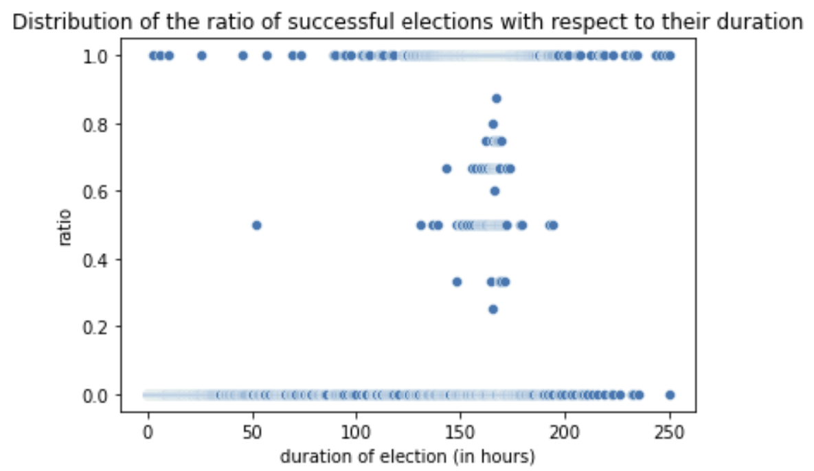
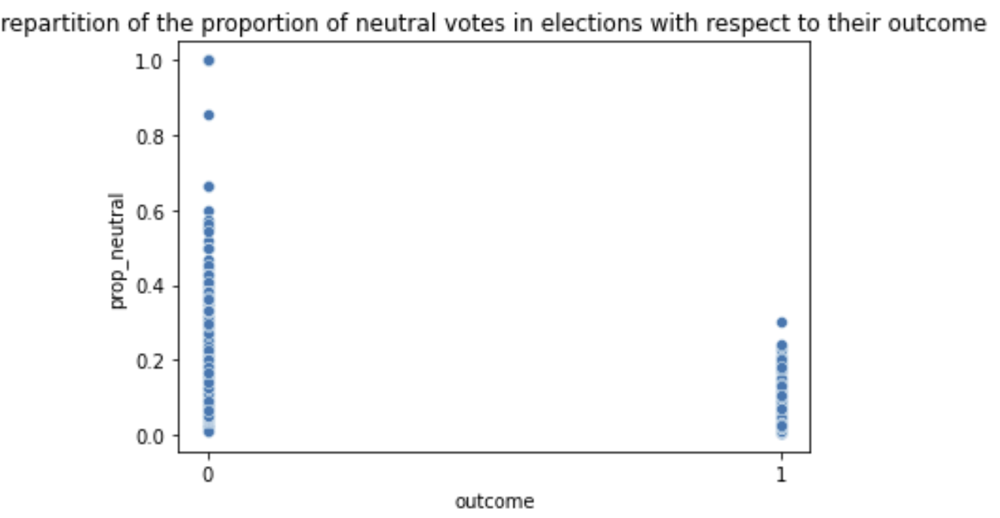
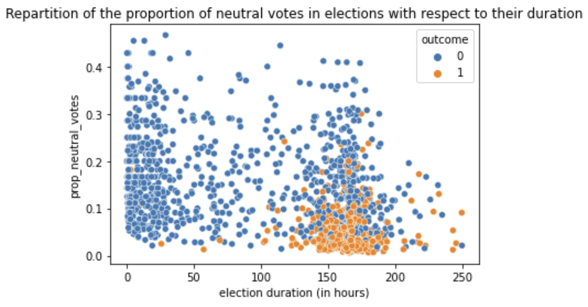

### YO BANANA BOY

# WIKIPEDIA 
What can we learn from Wikipedia adminship elections ? 
How social network structure potentially influences voting in a time-dependent manner: analysis of a signed social network. 

Politics are everywhere. 
From seeking to be the class representative of your 5th grade class, to announcing you will be running for president (never say never, sometimes dreams DO come true), you are most likely to be involved in some kind of election throughout your life. 
We do not yet have the magic trick that will ensure you to be elected next time you run, but we are working hard on it. And for that, we chose to analyse past elections, exactly like football players review past games to improve their strategy. 
To this end, we chose to look back on Wikipedia Adminship elections that happened between 2004 and 2008. 
For some context : Wikipedia is the free online encyclopedia that we all know and love. Its articles are written by volunteers, amongst whom we can distinguish Administrators. In addition of being able to write articles, those people also have access to technical features of the website, especially the ability to help with its maintenance. But not anyone can become an admin that easily ! Adminship seekers have to go through a public election process which determines whether or not they are promoted. If you are more curious, a list of all admins can be found [here](https://en.wikipedia.org/wiki/Special:ListUsers?username=&group=sysop&wpsubmit=&wpFormIdentifier=mw-listusers-form&limit=50)

**And now we ask : Tell us what you got Wikipedia !**

### TEMPORAL ANALYSIS 
## DATE
If you could choose the time of year your election will be held, would a certain move be more strategic than another ? We definitely know that people are cheerier when, for example, Santa's coming to town, but is it to the point where it could influence a vote they would cast at this time of year? Or do people that cast their votes around this period of the year that you usually spend with your loved ones, far away from your screen, tend to somewhat adopt the mind set of the Grinch? 
Let's take a look. Its is important for further analysis to firstly observe at how the number of elections evolved over time, when grouped by year.

*

We can notice an important increase (actually, even an exponential-like increase) in the number of elections between 2004, 2005, 2006 and 2007.  In the perspective of refining our analysis, let's see what this evolution looks like if we group the number of elections by day. 

*include time_plot2.html %}*

The first thing that pops out is the peak on May 3, 2007, during which more than 300 elections were closed. XXOne could of course suppose that the death of Warja Honegger-Lavater, the famous Swiss Illustrator, might have caused several patriots to realise that Swiss artists are poorly recognized on Wikipedia, which might have inspired them to seek adminship in order to try and make up for this.  (Yes, this is quite unlikely... but she was REALLY talented).  XX
*find another explanation*
Anyway, what about the number of votes ? We could easily suppose that they tend to follow a similar trend than the number of elections, but let's actually verify it. 



So we have seen that the number of elections and votes have increased between 2004 and 2008. But what about the election outcomes? 

Add plots 

XXX

*include data_with_size.html %}*

## DURATION 
O.K., so now you have chosen the perfect date for your election to be held. But it is not the only parameter to take into account if you want to maximize your chances of being elected. Another important point is the duration of the election. As Wikipedia elections are public and a discussion between voters happens during the election duration, we can identify the duration of the election with the optimal length of time during which you should campaign and hope that after this time your election gets closed.
We analyse a large variety of durations to get a good grasp on the infuence of this parameter. 

*include histogram_durations1 %}*

Let's also check if the different distributions of election durations are different between succeeded and failed elections 

*include histograms_durations2 %}

More than 75% of the elections lasted less than 180 hours, meaning less than 2 weeks. In order to obtain a satisfying representation while preserving its meaning and relevance, we will plot the fraction of positive votes for each election with respect to its durations, while only considering elections lasting less than 250 hours.  

We can clearly see 2 clusters. ELections that lasted close to 250 hours are more likely to have a positive outcome. On top of that, elections that only lasted a very brief amount of time, meaning less than 50 hours, are way more likely to end with a negative outcome. 
This repartition seems coherent with the fact that shorter elections are rather unsuccessful. This can also be explained by the fact that Wikipedia bureaucrats tend to close elections that cumulate almost only negative votes from the beginning, resulting in short, failed elections. XXis that a fact or do we assume it?XX 

Rewrite, same as notebook
*However, we know that the decision of the outcome of an elections does not only stand on the fraction of positive votes over the total number of votes. There has been some cases where bureaucrats had the power to make an election unsuccessful even if the fraction of positive votes exceeded 0.5. Thus, to go a bit further and try to visualize that, we are going to group the elections by durations (in hours, up to second precision) and plot the fraction of election with a positive outcome for each duration.*

*What does this plot tells us ? Well, firstly it seems coherent with the previous one, meaning that longer elections appear to display a higher ratio of positive outcomes than elections lasting a shorter amount of time. Secondly, we can see that among the elections lasting less than 100hours, very few of them had a positive outcome.*

**Conclusion: Give people time to know you, to hear your opinions, and discuss about your program!**

## TIME 
 
Let's now imagine you are in the middle of your election. Votes are being casted, votes are being counted, and you are biting your nails, in the middle of all this. So many questions are flying thick and fast through your head. *Should I be worried that the first votes are mainly negative ? Can tendencies be reversed ? Can people be influenced by other people's votes ?* At first sight, this last one obvioulsy applies mainly to the public elections like Wikipedia, but is worth mentioning for all elections : when an important election is coming up, people talk about it and can influence each other, whether it is within a family, a friend group or even through the media !
In this next part, we have analysed the evolution of the votes throughout an election for you, with the hope that it would ease your mind and answer your questions. Yes, if it was not obvious yet, we hate a tormented mind. 

Below is a plot representing the average vote with respect to time for all elections, both successful and failed. Remember, -1 is a vote against, +1 a positive vote, and a neutral vote takes the value of 0.  In case you are not sure what this average vote tells you, an average vote over 0 means that, so far, overall more positive than negative votes have been casted and the exact opposite is true for an average vote under 0.





As we can see, a few elections have lasted a very long time compared to the rest, as already discovered beforehand, making it hard to observe any clear pattern at first. However, we can see that the longest elections had a positive outcome, which is consistent with our previous analysis in the DURATION part. 
- Only few elections were strongly positive or negative, and those that were lasted only a very short amount of time. This tells us that if an election takes a strong tendency from the very beginning, bureaucrats are more likely to consider it a foregone conclusion and close it. It might seem understandable, but that yields an open door for you if you have a larger social network ! Call your friends, your family, your colleagues, tell them to vote for you really quick, and you could have it in the bag. 
Seems too good to be true right ? So it made us ask ourselves : Wikipedia, do you have any mechanisms in place to prevent such a thing ? 

- Also, elections with a very strongly positive vote do exist, but no failed elections has an averga vote lower than -0.09. This is a good sign, meaning that overall people are more likely to vote in favour than against someone. 

But don't get too confident just yet. In fact, we have computed that while 73.6% of the votes are positive, only 44.6% of elections are successful. Yes, you read that right. This could be explained by the fact that bureaucrats can close an election at any time, or by the fact that few successful elections regroup a large amount of the positive votes. This is possible since duration does not tell us the rythm at which the votes are casted.

But let's investigate that. We kept track of both the number of votes per elections and their ending average vote value. so let's see :
*is this next part to keep in the data story ?*
XX ------------------------
For successful elections..
- The minimal average vote of an election was -0.00038, for a total of 47 votes casted for said election, while the maximal average vote was 0.77778 for a total of 27 votes casted for this election. 
- The mean average vote of an election was 0.00437, while the median average vote was 0.00128. 

For failed elections ...
- The minimal average vote of an election was -0.09477 for a total of 29 votes casted fir said election, while the maximal average vote was 006358 for a total of 81 vote scasted for the corresponding election. 
- The mean average vote of an election was -0.00005, while the median average vote was -0.00005. 

We observe that for failed election, both mean and median appear to be  equal at this precision level, and that the median vote for failed elections is very close to 0. However, for successful elections, the election with the maximal mean vote only counted 27 votes casted. 
XX-----------------------------

Let's take a closer look at the elections which duration did not exceed the third quartile of the distribution of the durations. 



Weirdly, a few failed elections have an overall positive mean vote. However, we could not find any successful election with a overall negative mean vote. To justify that, we would have to go further in the analysis of the comments written live during the lection process. 

**Can we observe the Information cascade phenomenon ?** 
Well first, what is an information cascade ? In our case, it would mean that as soon as a certain amount of positive or negative votes have been casteed, nearly all of the following votes will adhere to the direction they give to the elction. This is the illustration of the the human nature being tempted to do as the ones before one did. If you want more details, we OF COURSE could only recommend the (Wikipedia)[https://en.wikipedia.org/wiki/Information_cascade] page.
One might expect to see this kind of behaviour for Wikipedia public elections, and in any setting in which voters tell future voters the nature of the vote they casted.  

## ANALYSIS OF NEUTRAL VOTES 
Let's say your election is closed, votes have been counted, and you did not get elected. But sticks and stones won't break your bones, and you decide to analyse the election process in order to learn from your mistakes and maybe take another chance later. 
What do neutral votes say about your election ? What do neutral votes say about the electors's opinions ? 
First, we have found that if there were no neutral votes casted for one election, there is a 53% chance of being elected. Meaning that maybe, no one casted a neutral vote and you have been rejected anyway, and this next part won't serve you.. 
But anyway, we dove into the elections where at least one neutral vote was casted per election. We have investigated whether or not neutral votes can correlate with the outcome of the election. There is a potential relationship between the fraction of neutral votes over the total number of votes, and the outcome of the election. 

We can see that a high fraction of neutral votes is correlated with a negative outcome of the election. This could be interpreted in several ways, since we have not much additional information on how these votes are taken into account by Wikipedia bureaucrats. 
One could suppose that voters did not have a set opinion on you, the adminship seeker, and thus they voted neutral. This could be explained by the fact that your campaign was not strong enough to turn the opinions of people that did not know you before. They were not convinced, but not disappointed either, hence they voted neutral. This seems rather unlikely to us as no one is forced to cast their vote for every election so why would they make the effort to cast a neutral vote? But who knows...
Another explanation is that people were really not convinced that you would be a good Wikipedia administrator, but they actually knew you as a person, and as the elections are public, they did not want to hurt any feelings. Hence they chose to cast a neutral vote rather than a negative vote. 
Finally, it could be explained if people voted firstly positive or negative, and then decided to change their vote later on. As the very famous Francis Picabia stated, "our heads is round so that it allows our thinking to change direction." How inspiring.. However, it is not mentioned whether or not voters are able to change an already casted vote. 
Let's be honest, in all three cases, your feelings might have been spared, but one could say you missed your shot.

Another correlation that can be investigated is the one between the proportion of neutral votes and the duration of the elections. If a larger fraction of neutral votes are casted, one could suppose that more people are perplex about you candidacy, and that overall it would take more time to settle the decision. This could mean that next time, you should campaign better and for longer in order to turn more's people opinion. 

We can see that most of the unsuccessful elections counted a higher fraction of neutral votes compared to the successful ones. We could infer that over a threshold of neutral votes, you will have very little chance of being elected, namely over 20% of neutral votes. Also, with a same ratio final ratio of neutral votes, an election is more likely to be successful if it lasted for a longer period of time. 

### CONCLUSION



notes 
- if people have more time to vote, might be most likely to be elected, so campaign for longer. 
